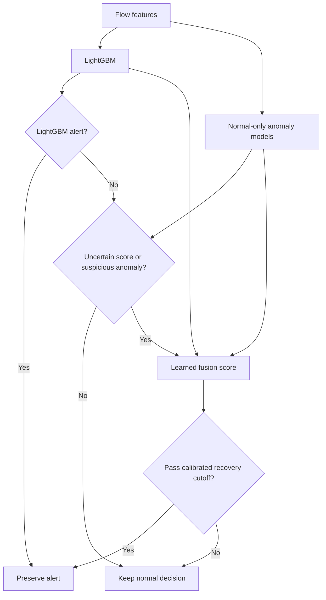

# Nexus

**Recover attacks a strong supervised detector misses, while measuring the extra false-alert cost.**

Nexus is a network-intrusion detection research project for the challenge
*Catch the Attack the Signatures Miss*. It uses UNSW-NB15 flow features to label
traffic normal or attack and support SOC review. Its current research combines
LightGBM with complementary anomaly scores through learned and selective fusion.
Alerts go to analysts; the project does not automatically block traffic.

The local application already serves LightGBM predictions with TreeSHAP
explanations, prediction logging and an analyst dashboard. **Fusion results are
currently offline research; the new policy is not yet integrated into serving.**

| Start here | Contents |
| --- | --- |
| [Serving model and cleanup status](docs/MODEL_IMPROVEMENT_STATUS.md) | Selected checkpoint, metrics, candidate outcomes and retained dependencies |
| [Current model assessment](reports/current_model_assessment.md) | Eight-seed results, failures, research contribution and next experiments |
| [Experiment commands](training/FUSION_EXPERIMENTS.md) | Reuse, training, calibration, evaluation, extra seeds and plots |
| [Training workflows](training/README.md) | Active entry points and historical-code boundaries |
| [Local demo](docs/LOCAL_DEMO.md) | Backend, frontend and historical dataset replay |
| [API contract](docs/api.md) | Prediction, alert and analyst-feedback endpoints |

## Where we stand

The latest evaluation contains **960 result rows**: four scenarios, ten methods,
three calibration FPR budgets and eight seeds. The scenarios are closed-set
(`none`) and withheld Reconnaissance, Exploits and DoS. Seeds are
7, 21, 42, 100, 123, 314, 1337 and 2026.

At the **3% calibration FPR budget**, selective fusion produces the following
means across eight seeds. Recovery counts cover all evaluation attacks in each
scenario; they are not counts exclusively from the withheld family.

| Scenario | LightGBM recall | Selective recall | Selective observed FPR | Additional attacks recovered | Lost LightGBM detections | Additional false positives |
| --- | ---: | ---: | ---: | ---: | ---: | ---: |
| Closed set | 93.169% | 93.178% | 3.089% | 1.63 | 0 | 0.25 |
| Reconnaissance withheld | 92.734% | 92.767% | 2.986% | 16.50 | 0 | 1.00 |
| Exploits withheld | 93.882% | 94.141% | 3.067% | 154.88 | 0 | 3.25 |
| DoS withheld | 95.504% | 95.519% | 3.046% | 6.88 | 0 | 1.13 |

The strongest current case is **Exploits recovery**. At 3%, its withheld-family
recall increases from 93.746% to 94.189%; the overall recovery/added-FP ratio is
47.65 when pooling the repeated-seed counts. These repetitions are not unique
attacks from independent deployments.

Selective fusion preserved every baseline detection in all **96**
scenario/seed/budget configurations. This is enforced by its decision rule.
It does not guarantee zero extra false positives: only four of eight Exploits
runs met the nominal 3% evaluation cap, as did the paired LightGBM baseline.

The experiments also exposed approaches that should not be promoted:

- Unrestricted learned fusion has larger mean gains in some settings, but loses
  detections in others. At 3%, its mean net gain is +269 Exploits detections,
  versus -98.50 for Reconnaissance and -24.75 in the closed-set scenario.
- Naive OR raises mean FPR to roughly 5.8% when each detector receives a 3% budget.
- Standalone anomaly detectors have substantially weaker recall than LightGBM
  at practical FPR budgets. Denoising and scaling did not establish a universal
  improvement over the plain AE.
- Selective recovery is small for DoS and almost negligible for closed-set traffic.

These findings improve the model-selection evidence and identify a useful
recovery policy. They do not establish a universal accuracy improvement,
production readiness, or better runtime performance.

Source: [model assessment and evidence links](reports/current_model_assessment.md).
The older [validated binary result](reports/binary_validated_result.md) belongs
to a different experiment and must not be compared directly with these figures.

## Our approach



This diagram describes the offline selective-fusion candidate. Its operating
policy preserves LightGBM positives and considers uncertain or anomalous
negatives for recovery. Score gates are configurable; they are not calibrated
probabilities or proof that a flow is malicious.

1. **Keep related rows together.** Identical predictor rows share a partition.
   Groups containing a withheld family are excluded from all development stages.
2. **Separate development stages.** Remaining groups are allocated to fitting
   (55%), early stopping (10%), fusion fitting (10%), calibration (10%) and
   evaluation (15%). Row fractions vary with group size.
3. **Fit complementary detectors.** LightGBM sees fitting rows; anomaly models
   learn from benign fitting rows. Compare plain, scaled and denoising AEs,
   latent covariance distance, and Isolation Forest.
4. **Learn fusion on unseen fitting data.** Logistic fusion uses the LightGBM
   score, log reconstruction error and log latent distance on its disjoint partition.
5. **Calibrate the combined decision.** Thresholds use benign calibration rows
   at budgets of 1%, 3% and 5%. Selective recovery can spend only the allowance
   remaining after the preserved LightGBM alerts.
6. **Report both gains and costs.** Precision, recall, F1, FPR, ROC-AUC, PR-AUC,
   held-family recall, recovered/lost detections and gross/net added FPs accompany
   seed means, SDs and paired differences. Plots use the saved experiment CSVs.

The original nine comparisons remain reproducible alongside `selective_fusion`.
There is no automatic winner selection, model promotion or deployment.

## Contribution and comparison with existing projects

Our contribution is a **reproducible, budget-calibrated recovery layer** around a
strong supervised detector. The central question is: *what does the second
model catch, what does it break, and how many false alerts does it cost?*

This is an engineering and experimental contribution. Combining classifiers and
autoencoders, conditional routing, and anomaly detection are not new inventions.
A score-only fusion control is still needed to isolate how much of the gain
comes specifically from anomaly information.

| Comparison | What we can support |
| --- | --- |
| LightGBM alone, on our paired splits | Selective fusion recovers additional attacks without removing baseline alerts; Exploits is the strongest result. |
| Naive OR, on our paired splits | Selective recovery adds far fewer false positives, with a smaller recall increase. No dominance at identical external-test FPR is established. |
| A basic classifier demo | Nexus exposes leakage controls, held-family tests, seed variation and the cost of complementary detection, alongside an existing analyst-review application. |
| Snort, Suricata and Zeek | A potential complementary ML component. We have not run a paired benchmark demonstrating superiority over these tools. |

[Snort supports rule-based IDS/IPS detection](https://docs.snort.org/rules/).
[Suricata already produces alerts and anomaly events](https://docs.suricata.io/en/suricata-8.0.5/output/eve/eve-json-output.html),
and [Zeek supports programmable notice policies](https://docs.zeek.org/en/master/frameworks/notice.html).
Anomaly handling and analyst-facing alerts are not exclusive to Nexus.
Demonstrating signature-bypass coverage requires a common traffic corpus and an
actual signature-IDS baseline; withheld-family flow classification is not that test.

## Research foundations

| Paper | Insight used and scope |
| --- | --- |
| [UNSW-NB15 — Moustafa & Slay, 2015](https://doi.org/10.1109/MILCIS.2015.7348942) | Benchmark foundation for the current flow-feature experiments. |
| [LightGBM — Ke et al., NIPS 2017](https://proceedings.neurips.cc/paper_files/paper/2017/hash/6449f44a102fde848669bdd9eb6b76fa-Abstract.html) | Gradient-boosted tree foundation for our primary supervised detector. |
| [Kitsune — Mirsky et al., NDSS 2018](https://arxiv.org/abs/1802.09089) | Motivation for normal-behavior learning with autoencoders. Our flow-level models do not reproduce Kitsune's online packet-feature ensemble. |
| [Dos and Don'ts of ML in Computer Security — Arp et al., USENIX Security 2022](https://www.usenix.org/conference/usenixsecurity22/presentation/arp) | Evaluation guidance: leakage, sampling bias, misleading metrics and unsupported security claims. |
| [Autoencoders for Anomaly Detection are Unreliable — Bouman & Heskes, 2025 preprint](https://arxiv.org/abs/2501.13864) | Reconstruction error can fail to distinguish anomalies; motivates comparing scores and measuring complementary value rather than assuming AE superiority. |
| [DeepAID — Han et al., CCS 2021](https://arxiv.org/abs/2109.11495) | Inspiration for investigating anomaly explanations and false positives. DeepAID's interpreter is not implemented; current TreeSHAP explains LightGBM. |

These references inform the design. Their published results are not results
achieved by Nexus, and we do not claim to outperform their systems.

## Reproduce the model research

Python 3.11+ and the local UNSW-NB15 training CSV are required. Models, datasets,
split indices, raw results and release bundles remain Git-ignored and local.

```sh
python3 -m venv .venv
.venv/bin/python -m pip install -e '.[dev,training]'
.venv/bin/python -m pytest -q tests/test_anomaly_detection_models.py
```

Start a new experiment directory; existing directories are never overwritten:

```sh
.venv/bin/python training/run_novelty_experiment.py \
  --output-dir artifacts/fusion_next_run \
  --families none Reconnaissance Exploits DoS \
  --seeds 42 123 2026 --fpr-budgets 0.01 0.03 0.05
```

This trains and evaluates the models. If the local v1 suite exists, use
`--reuse-dir artifacts/anomaly_comparison_v1` to reuse its matching seeds and
fitted models. Full commands for all eight seeds, calibration, reporting and
plots are in the [execution guide](training/FUSION_EXPERIMENTS.md).
Everything runs in the foreground. No experiment starts automatically.

## Limitations and next steps

- Internal development holdouts are not independent external confirmation.
  Repeated seeds share data; no statistical-significance claim is made.
- A calibration FPR cap can be exceeded on evaluation or drifting traffic.
  In 88/96 configurations, LightGBM already consumed all calibration FP slots.
- Exact-row grouping does not establish session or temporal independence.
- High benchmark precision need not transfer to low-prevalence production traffic.
- Reconnaissance subtype labels cannot reliably be joined to benchmark rows.
  TCP/FIN and service slices are diagnostics, not invented attack subtypes.
- Attack-type classification exists as an optional offline diagnostic; unknown
  rejection and end-to-end family classification remain unfinished.

Next model work: a LightGBM-score-only fusion control, plain-AE versus denoising-AE
fusion ablations, explicit budget allocation, and independent confirmation.
Measure latency and drift before claiming operational improvement. Fusion
integration with the application remains a separate milestone.

## Repository layout

| Path | Role |
| --- | --- |
| `training/` | Current experiment runner, anomaly/fusion models, reporting and required historical training helpers |
| `tests/` | Model invariants, API behavior and integration checks |
| `reports/` | Curated research assessments; raw generated reports stay local |
| `models/` | Local frozen checkpoints, including `lightgbm_validated_v1` |
| `artifacts/` | Local experiment suites, aggregate CSVs, plots, logs and release bundles |
| `experiments/` | Retained historical LightGBM provenance needed by the binary report |
| `src/nexus/`, `web/` | Existing LightGBM-serving API and SOC console |
| `docs/` | API contract and local demo instructions |

For the application, use the [local demo guide](docs/LOCAL_DEMO.md). Dataset replay
is historical traffic replay, not live packet capture or independent evaluation.
